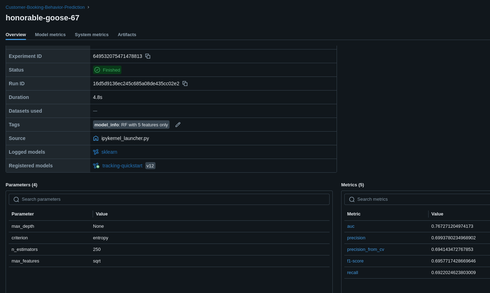
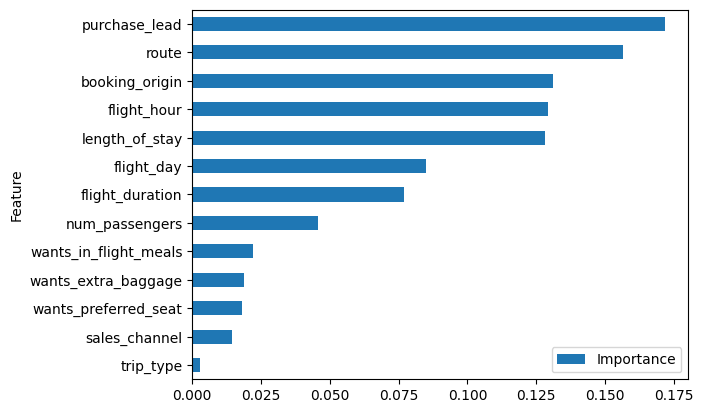
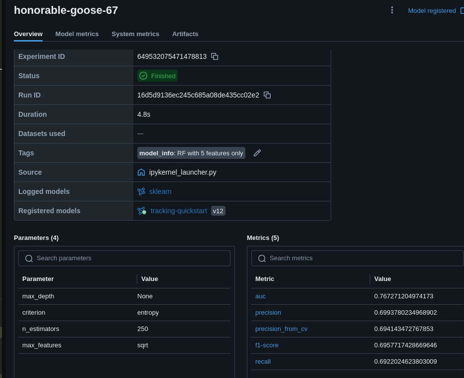
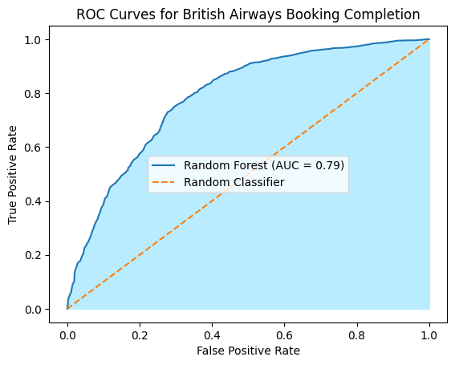
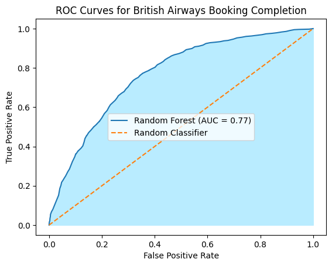

# Overview
## Data
The dataset for predicting customer buying behavior contains a history of customer booking. There are 50,000 bookings with 14 columns. Below is the detailed description of each column: 

- `num_passengers` = number of passengers travelling
- `sales_channel` = sales channel booking was made on
- `trip_type` = trip Type (Round Trip, One Way, Circle Trip)
- `purchase_lead` = number of days between travel date and booking date
- `length_of_stay` = number of days spent at destination
- `flight_hour` = hour of flight departure
- `flight_day` = day of week of flight departure
- `route` = origin -> destination flight route
- `booking_origin` = country from where booking was made
- `wants_extra_baggage` = if the customer wanted extra baggage in the booking
- `wants_preferred_seat` = if the customer wanted a preferred seat in the booking
- `wants_in_flight_meals` = if the customer wanted in-flight meals in the booking
- `flight_duration` = total duration of flight (in hours)
- `booking_complete` = flag indicating if the customer completed the booking

## Objectives
* Build the model to predict customer buying behavior
* Find the contribution of each variable
# Result
## Model
### Model with input of 13 features
With Random Forest as the model and precision as the metric, the precision score is 0,713.

### Feature Contribution
Below, is the contribution of each variable to customer buying behavior:

### Model with input of 5 features
Meanwhile, model with 5 high contribution has lower precision score, it's 0.6993

### Analysis of AUC on both models
Model with 13 input features has higher AUC (AUC = 0.79) than model with 5 input features (AUC = 0.77). Means that Model 13 input features can easily distinguishes between classes (which behavior lead to booking completion or not). 

Customer buying behavior is highly affected by the following:
* How long did the customer book the plane before the travel 
* The duration, the route, and the origin of the customer
* and how long the customer will stay at the destination
